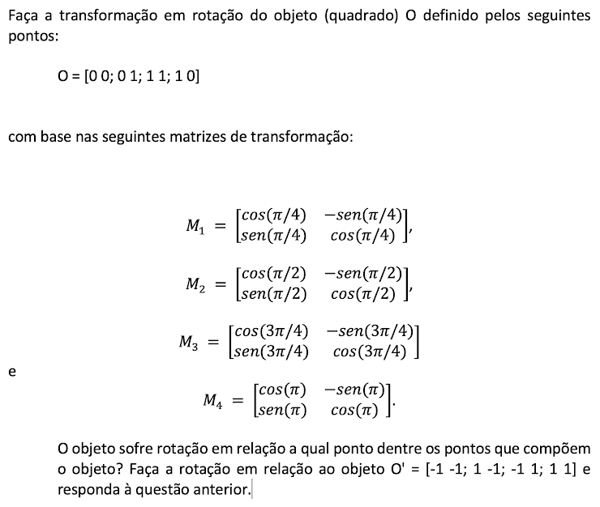

<h2>Atividades Transformação por Rotação</h2>

1. Os pontos (-1,1) e (0,0) formam a aresta de um quadrado. Calcular os outros dois vértices com base em uma matriz rotação. Desenhe o quadrado e seus quatro vértices.

2. 

3. 
